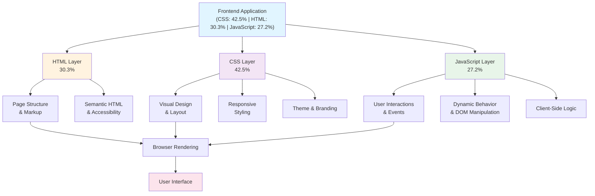

# Architecture Overview

This document provides a visual overview of the project architecture based on its language composition.

## Project Structure

## Components

### HTML (30.3%)
- Provides the structural foundation
- Contains semantic markup and accessibility features
- Defines the DOM structure for the web pages

### CSS (42.5%)
- Largest component, responsible for visual presentation
- Handles responsive design and layout
- Manages theme, colors, and styling

### JavaScript (27.2%)
- Adds interactivity and dynamic functionality
- Handles user events and DOM manipulation
- Implements client-side logic and behavior

## Data Flow

1. **User Interaction** → JavaScript captures events
2. **Event Handler** → Processes logic and updates DOM
3. **DOM Update** → HTML structure changes
4. **CSS Reflow** → Styles recalculate and render
5. **Browser Renders** → Updated UI displayed to user

---

*Last Updated: 2026-04-17*